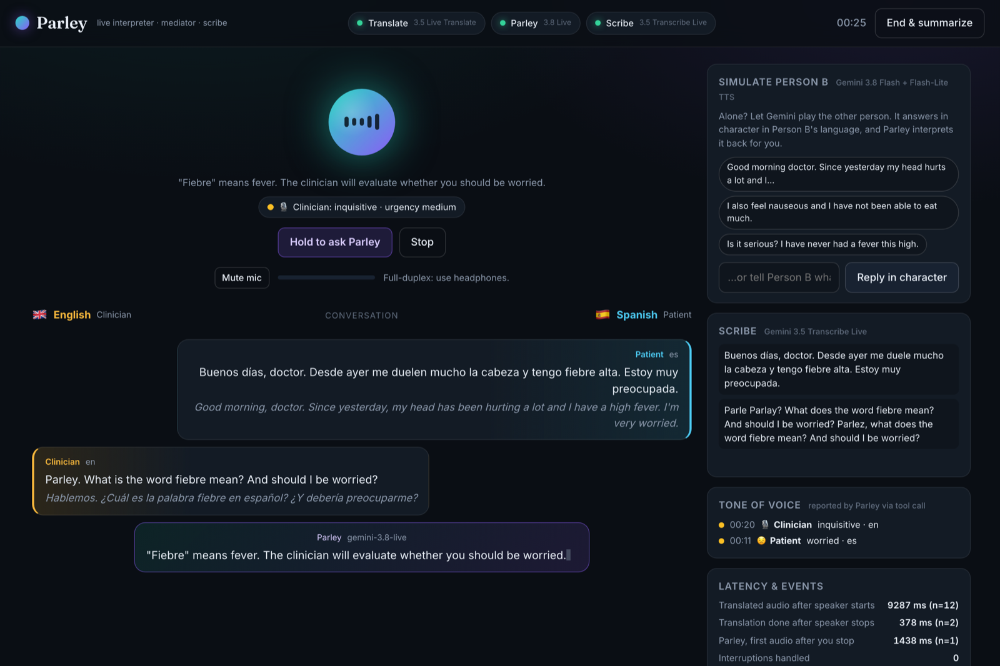
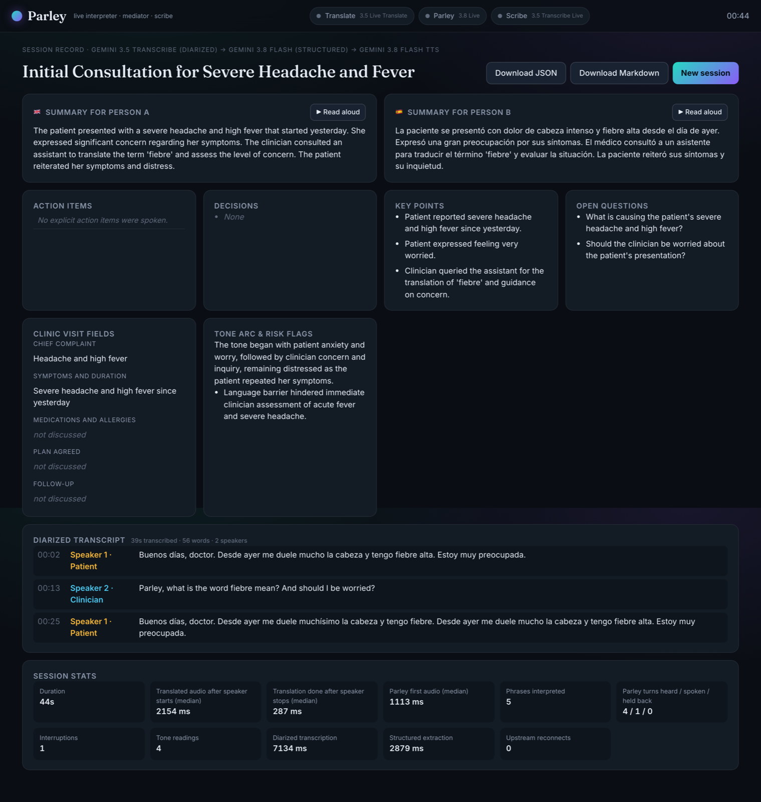

<p align="center">
  
</p>

# Parley

**A real-time interpreter, mediator and scribe for two people who do not share a language.**

Built for the Google AI hackathon, Problem Statement 2 (Next-Gen Voice & Real-Time Audio), on the Gemini audio stack. One microphone, two languages, four Gemini audio models running at once:

| Model | Role in Parley |
| --- | --- |
| `gemini-3.5-live-translate-preview` | Simultaneous speech-to-speech interpretation, both directions, with per-phrase language detection |
| `gemini-3.8-live` | "Parley", an interruptible voice assistant in the room: answers when addressed, reports every speaker's tone of voice, notes commitments |
| `gemini-3.5-transcribe-live` | Live verbatim scribe pane |
| `gemini-3.5-transcribe` | Post-session transcription with speaker diarization and word timestamps |
| `gemini-3.8-flash` | Structured record (JSON schema) and the in-character simulated counterpart |
| `gemini-3.8-flash-tts` / `gemini-3.8-flash-lite-tts` | Streaming spoken readback of the record; voice of the simulated counterpart |

- **Live demo:** https://parley-production-085b.up.railway.app/
- **Writeup:** [WRITEUP.md](WRITEUP.md)
- **Foundation:** [gemini-whisper-local-main/](gemini-whisper-local-main/), our teammate's Swift dictation app, whose Live transcript-merging logic we ported to TypeScript

## The one-minute tour

1. Pick two languages and a scenario (clinic visit, lease agreement, customer support, travel desk, general).
2. Talk. Either person, either language, one microphone. Parley detects who is speaking and *speaks* the translation in the other language. On headphones (hands-free, full duplex) the translation starts while the speaker is still talking and finishes about 300 ms after they stop; on laptop speakers (half duplex) it is held until the speaker pauses and played consecutively so nothing feeds back. **Tap to talk** mode streams the mic only while a turn is open and plays the translation whole.
3. Say **"Parley, what does *deductible* mean?"** and the assistant answers in your language, repeats it in the other language so both people follow, then stops. It stays silent otherwise. After every turn it reports the speaker's **tone of voice** (from the audio, via a tool call) and pins any **explicit commitment** it hears.
4. Talk over Parley and it yields instantly, whether it is still generating or the browser is still playing buffered audio.
5. Alone? **Simulate Person B**: Gemini 3.8 Flash writes the counterpart's next in-character line in the other language, Flash-Lite TTS voices it (streaming, first audio in about a second), and the same audio is fed through the live pipeline exactly as if someone had spoken it, so you hear it interpreted back.
6. **End & summarize**: the whole recording goes through diarized transcription, then structured extraction: summaries in both languages, decisions, action items with owners, scenario-specific fields (chief complaint, deposit, order number…), a tone arc and risk flags. Press **Read aloud** to hear it in either language.

<p align="center">
  
</p>

## Why this pushes the audio stack

The problem statement asks for voice-first experiences that handle mid-sentence interruptions, read vocal tone, translate in real time, and turn messy multi-speaker audio into structured action. Parley does all four, and none of it works typed into a chat box: the value is in two people simply talking.

| Requirement | How Parley meets it |
| --- | --- |
| Mid-sentence interruptions | Server-side `interrupted` from Gemini 3.8 Live while generating, plus a playback-aware barge-in: speech detected while buffered audio is still playing flushes the browser queue in one round trip. Local energy VAD ducks Parley's voice before the server even confirms. |
| Vocal tone | Parley calls `report_tone` (tone, urgency, language, speaker, `addressed_to_parley`) after every speaker turn, from the voice itself. It drives the orb, the tone timeline and the "tone arc" in the record. |
| Real-time translation | Two unidirectional Live Translate sessions (target A, target B, `echoTargetLanguage: false`) fed the same audio: whichever language is spoken, exactly one of them talks back. No language detection code needed. |
| Messy multi-speaker audio → structured action | The recording is diarized with word timestamps, cross-checked against the live translation pairs and the tone timeline, and reduced to a JSON-schema record with owners, dates and open questions. |

## Architecture

```text
Browser (public/)                                  Parley server (server/, Node 22 + TypeScript)
┌───────────────────────────────┐   WebSocket    ┌────────────────────────────────────────────────────────┐
│ AudioWorklet: mic → 16 kHz    │ ─ PCM16 up ──► │ ParleySession (one per browser)                        │
│ PCM16, 100 ms frames          │                │   fan-out of every mic frame, in real time, to:        │
│ Player: one shared timeline,  │ ◄─ JSON +      │   ├─ translate:toA  gemini-3.5-live-translate-preview │
│  flush on barge-in, ducking   │   framed 24 kHz│   ├─ translate:toB  gemini-3.5-live-translate-preview │
│ Feed, orb, scribe, tone,      │   audio down   │   ├─ agent          gemini-3.8-live  (tools, VAD)      │
│  metrics, record view         │                │   └─ scribe         gemini-3.5-transcribe-live         │
└───────────────────────────────┘                │   wake gating · phrase assembly · half-duplex gate     │
                                                 │   recording (16 kHz) · reconnects · session resumption │
                                                 ├────────────────────────────────────────────────────────┤
     "Simulate Person B"  gemini-3.8-flash ──► gemini-3.8-flash-lite-tts (SSE stream) ──► fed back in ────┤
     "End & summarize"    recording ──► gemini-3.5-transcribe (diarized) ──► gemini-3.8-flash (JSON) ────┤
     "Read aloud"         record ──► gemini-3.8-flash-tts (SSE stream) ──► browser                        │
                                                 └────────────────────────────────────────────────────────┘
```

Design decisions worth knowing:

- **Two translate sessions instead of one.** The translate model is unidirectional per session. Running target-A and target-B sessions side by side with `echoTargetLanguage: false` gives bidirectional interpretation with the model's own language detection; a phrase detected in a third language is treated as a misdetection and dropped rather than double-translated.
- **Two-key wake gating.** Parley's audio reaches the browser only when the turn was addressed to it: the model says so through the `addressed_to_parley` argument of `report_tone` (it heard the audio, so a garbled wake word does not fool it), the transcript matches a wake-word pattern, or the user holds **Hold to ask Parley** (a private aside: the mic then goes to the agent only, not to the translators). The prompt also asks the model to stay silent, but the server enforces it.
- **Blocking tools.** Gemini 3.8 Live defaults to non-blocking function calls; with the default, every tool result triggered a new generation that called the tool again (24 tone reports for 4 turns). Declaring both tools `BLOCKING` gives exactly one report per turn, delivered before any speech, which is what the gate needs.
- **Phrase assembly.** The translate model streams transcription fragments per phrase and an empty message when a phrase ends, but sends the same empty messages as keepalives. The assembler only opens phrases on text, closes them on the first empty message, and finalizes on new text after a close or on idle.
- **Half-duplex on speakers, full duplex on headphones, or tap to talk.** On laptop speakers, translated audio would be re-captured and translated back. In half duplex the server holds translations until the speaker has paused, plays them consecutively, and gates the mic while a translation or Parley plays (the gate expires from audio actually sent, not only from the browser's playback report). The translate model also streams digital silence between phrases; a peak-level filter drops it so the gate can open. Tap-to-talk needs no gate at all: the mic streams only while someone holds the floor.
- **One voice at a time.** The browser player owns one timeline and lets a source keep it until it finishes and goes quiet; two streams arriving together (a translation and Parley, say) never interleave. The stream whose target is the language just spoken is muted server-side, since it is not always silent on its own.
- **Keys stay server-side.** The browser never sees the Gemini key; the server caps concurrent sessions and session length. Visitors can also bring their own key.

## Measured on the real API (scripts/e2e.mjs, 26 Sept 2026)

| Metric | Value |
| --- | --- |
| First translated audio after the speaker *starts* (median) | 2.2–2.4 s |
| Translated audio complete after the speaker stops (median) | 190–350 ms |
| Parley's first audio after the speaker stops (median) | 1.0–1.6 s |
| Barge-in: `interrupted` event after speech starts over Parley | under 0.5 s |
| Simulated counterpart: line written + first audio | 3.8 s (was 8.7 s before streaming TTS) |
| Diarized transcription of a 62 s conversation | 7.4 s |
| Structured record (Gemini 3.8 Flash, JSON schema, `thinkingLevel: low`) | 3.6–4.6 s |
| Tone reports | exactly one per speaker turn |

## Run it locally

Requirements: Node 22+, a Gemini API key with access to the models above.

```bash
cp .env.example .env            # put GEMINI_API_KEY=... in .env (never committed)
npm install
npm run build && npm start      # http://localhost:8080
```

Open the page, allow the microphone, pick languages and a scenario, press **Start listening**. Use headphones for full-duplex; keep "Half-duplex safety" on for laptop speakers.

### Tests

```bash
npm test          # unit tests: transcript merging (ported from the Swift foundation), protocol, setups, audio, REST parsing
npm run e2e       # end-to-end against the real API: synthesizes speech, drives a live session, checks 15 behaviours
```

`npm run e2e` needs the server running with a key. It exercises translation in both directions, the scribe, tone reports, silence when not addressed, answering when addressed, barge-in, the simulated counterpart, the diarized record and the spoken readback.

## Deploy

The server is a single Node process that needs WebSockets, so anything that runs a container works.

- **Railway (what the live demo runs on):** new project from this repo, it builds the [Dockerfile](Dockerfile); set `GEMINI_API_KEY` in Variables.
- **Render (free tier):** click *New → Blueprint* in Render, point it at this repo; [render.yaml](render.yaml) provisions the service. Add `GEMINI_API_KEY` in the dashboard.
- **Google Cloud Run:** `gcloud run deploy parley --source . --allow-unauthenticated --timeout=3600 --session-affinity --set-env-vars GEMINI_API_KEY=…`
- **Docker anywhere:** `docker build -t parley . && docker run -p 8080:8080 -e GEMINI_API_KEY=… parley`
- **From a laptop for a live demo:** `npm start` then `scripts/tunnel.sh` (Cloudflare quick tunnel; no account).

Environment variables are documented in [.env.example](.env.example): model overrides, concurrent-session and session-length caps, and whether visitors may bring their own key.

## Judge's guide (two minutes, one person)

1. Choose **English ↔ Spanish**, scenario **Clinic visit**, hands-free with headphones (or **Tap to talk** on speakers), start. Three pills turn green as the upstream sessions come up.
2. Say in English: *"Good morning, what brings you in today?"* You hear it in Spanish; the card shows both texts and `en`.
3. Click a **Simulate Person B** chip. The "patient" answers in Spanish, you hear the English interpretation, and the tone chip shows what Parley heard in the voice.
4. Say: *"Parley, what does fiebre mean?"* Parley answers in English. Start talking while it speaks: it stops.
5. Hold **Hold to ask Parley** (or Space) and ask anything privately; the translators do not hear it.
6. **End & summarize**, then **Read aloud** in either language. Download the record as JSON or Markdown.

## Repository layout

```text
server/               TypeScript server
  index.ts            HTTP + WebSocket entry point, catalog endpoint, session caps
  session.ts          ParleySession orchestrator: fan-out, gating, phrase assembly, counterpart, summary
  gemini/live-client.ts  Gemini Live WebSocket client (setup, audio, tools, resumption)
  gemini/rest.ts      Interactions API (TTS, streaming TTS, diarized transcription) + generateContent JSON
  gemini/setups.ts    Setup messages and the agent's prompt and tools
  scribe.ts           Post-session pipeline and record schema
  counterpart.ts      Simulated Person B
  transcript.ts       Interim/final hypothesis merging, ported from the Swift foundation
  catalog.ts          Languages, scenarios, voices
  protocol.ts         Browser ↔ server message types and validation
public/               Vanilla JS client: app.js, audio.js (capture + scheduler), worklet-capture.js, styles
tests/                node:test unit tests
scripts/e2e.mjs       Real-API end-to-end check
gemini-whisper-local-main/  The Swift foundation (macOS dictation with Gemini 3.5 Transcribe Live)
```

## Limitations and next steps

- Sessions are capped (12 min by default) to protect the hosted key; the diarized pass covers the last 7 minutes inline (a Files API upload would lift this).
- Half-duplex mode mutes the room while a translation plays; simultaneous crosstalk needs headphones or per-person devices.
- Two languages per session. A third language is ignored by design.
- Next: per-participant devices over WebRTC, speaker-attributed live captions from the diarized model, and Lyria-generated hold music while the record is prepared.
